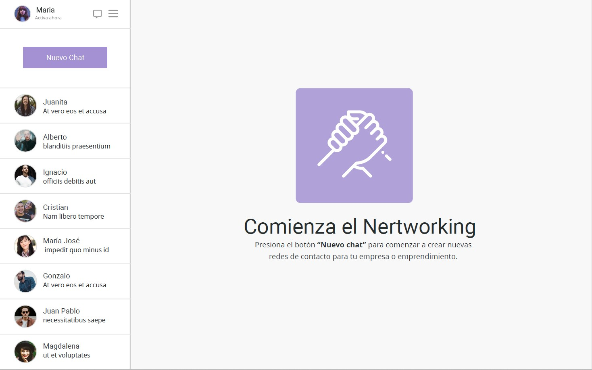
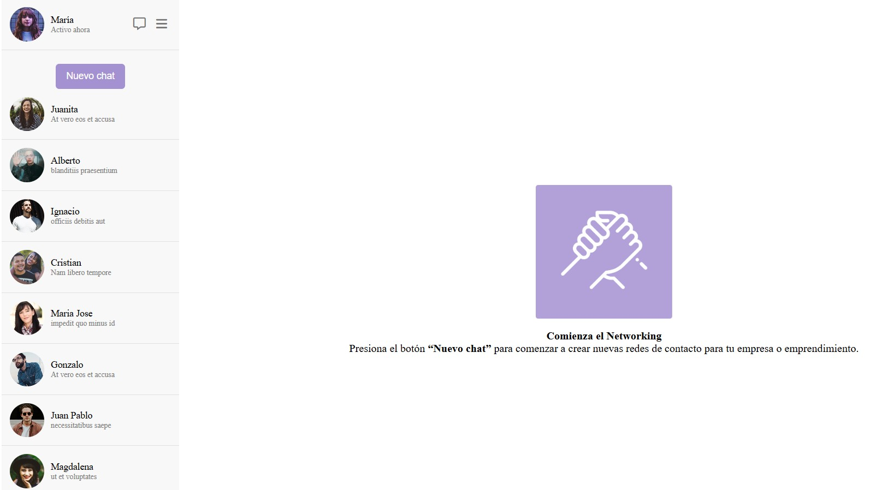

# 📌 Proyecto 1 de Flex 

Primer Desafío de Módulo 2 de CSS Avanzado.

## Objetivo 💡

La empresa Contact Me SPA está en proceso de maquetación de una de sus pantallas más
importantes: el sistema de mensajería y contactos para generar conversaciones en la
plataforma. Por lo cual, te han solicitado que realices el layout de la siguiente pantalla:

## Tecnologías 📲

- HTML
- CSS
- Flex

## Diseño Finalizado 🔨

